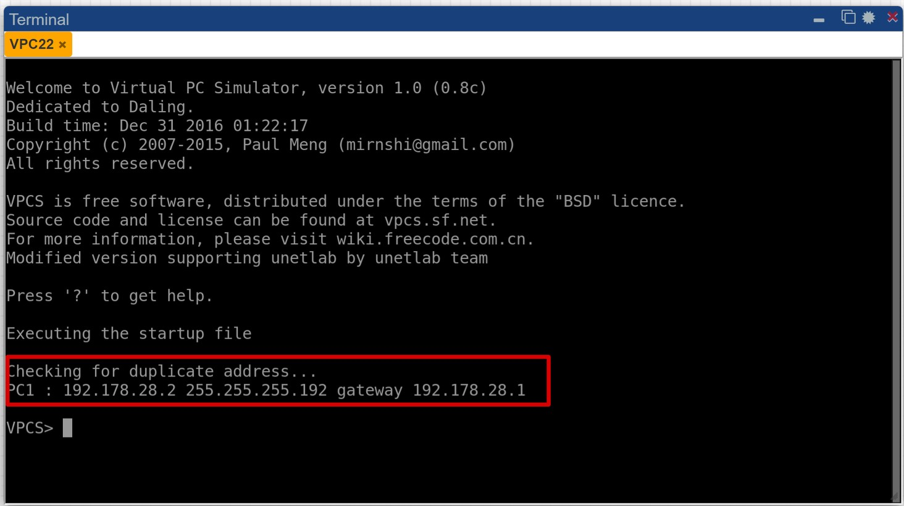
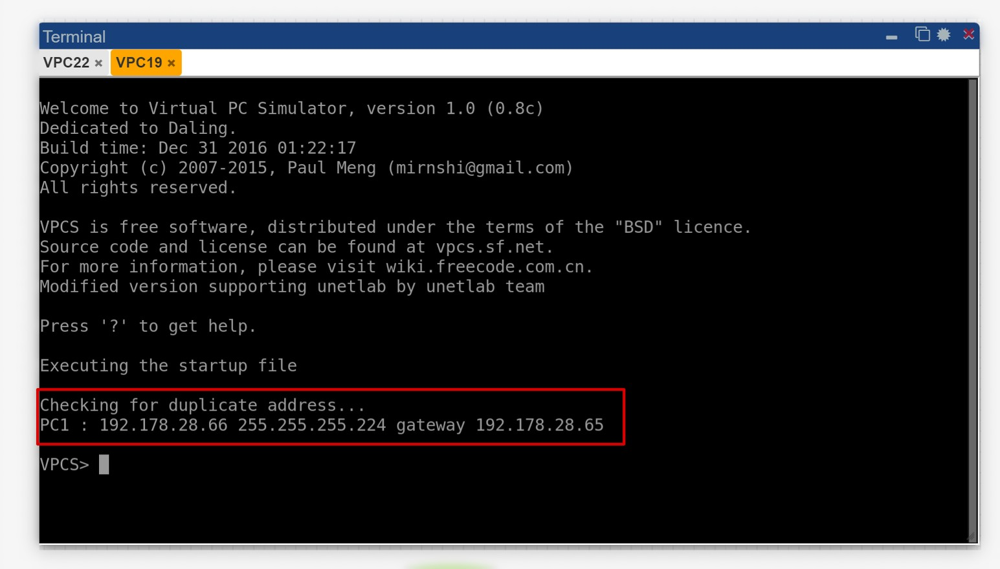
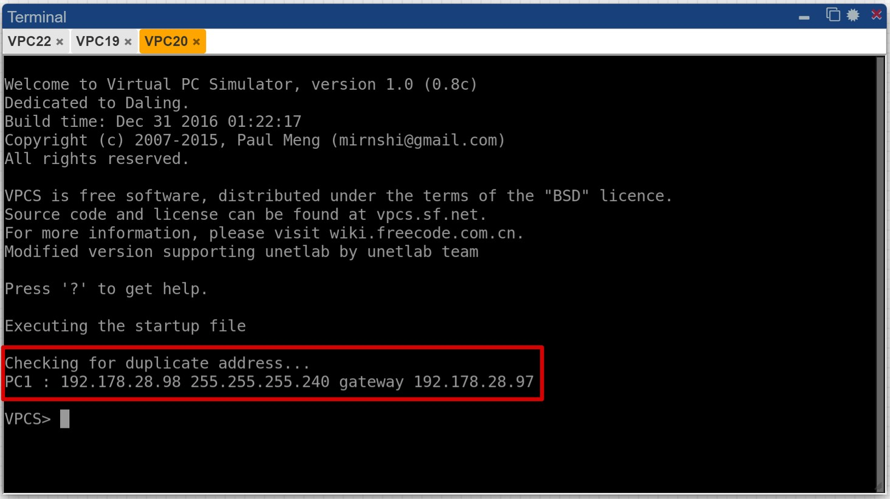
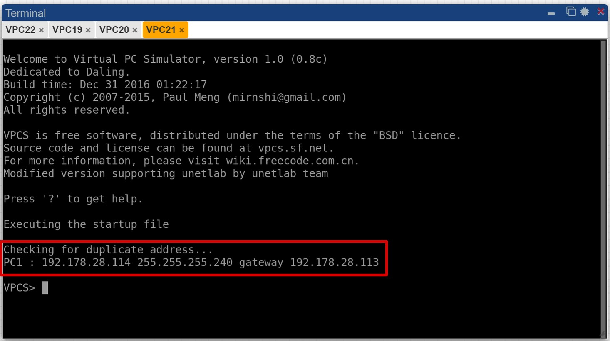
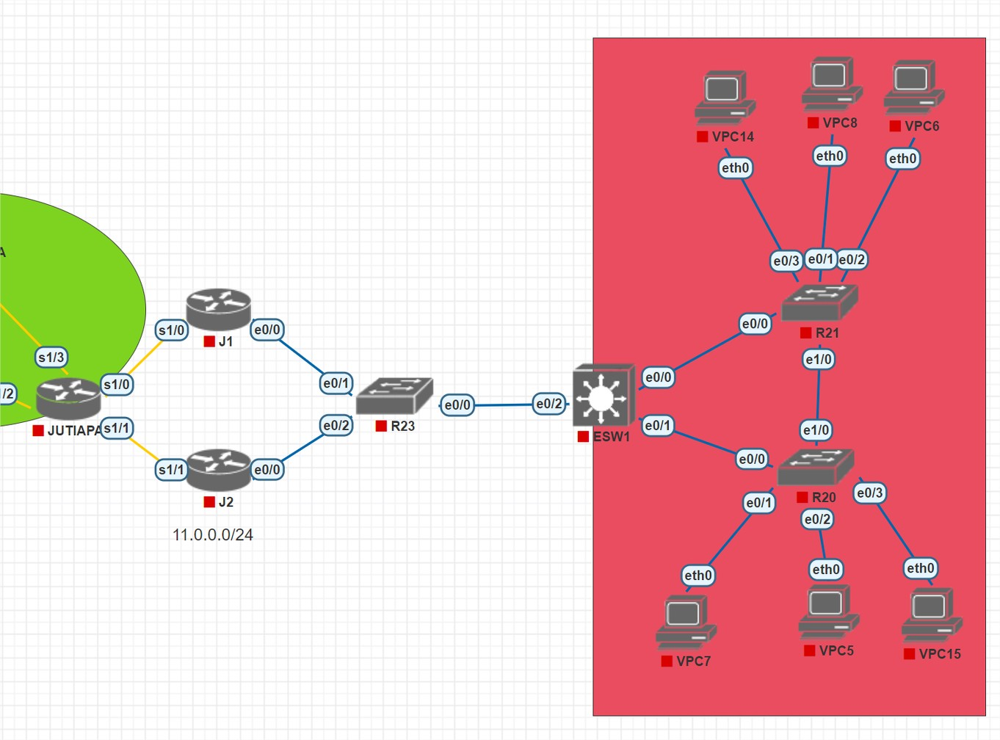
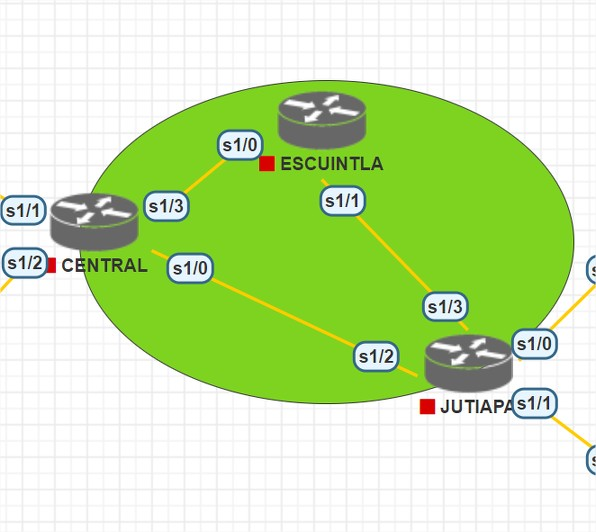
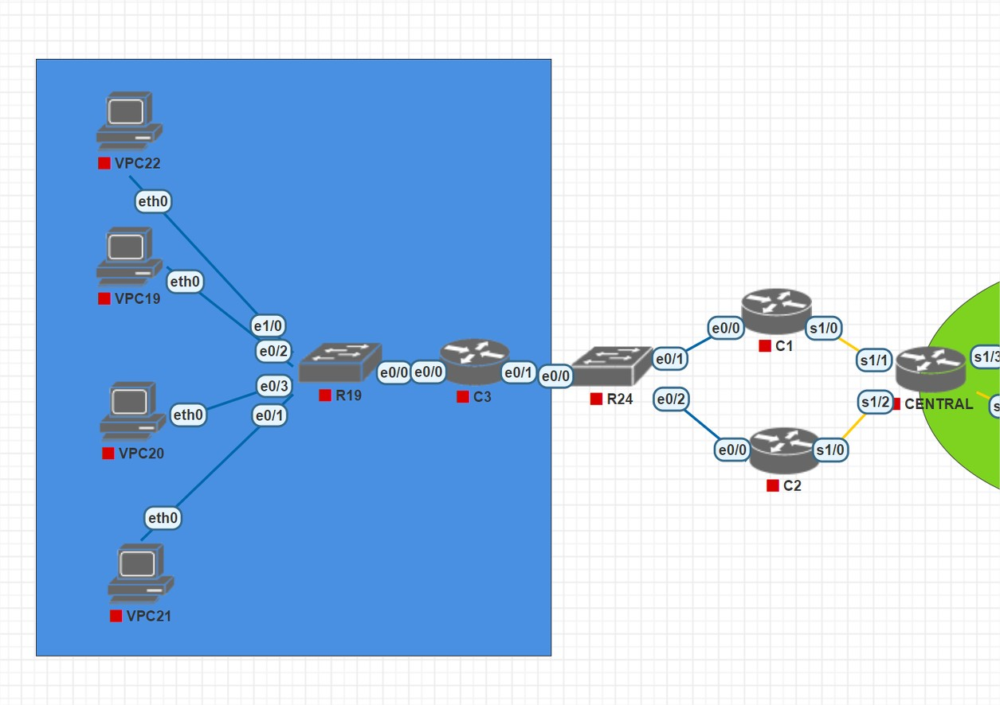
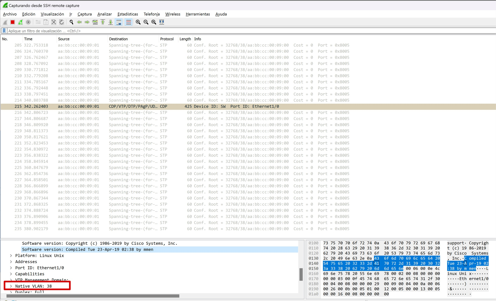

## Resumén de direcciones IP Y VLAN

_IP'S asignadas:_

_VPC VENTAS - IP ASIGNADA:_

_VPC INFORMATICA - IP ASIGNADA:_

_VPC RRHH - IP ASIGNADA:_

_VPC CONTABILIDAD - IP ASIGNADA:_

_VLAN'S creadas:_

_Se crean las vlan's 18, 28, 38 y 48, a través de las cuales se comunicaran las vpc's:_

Central :_

_Jutiapa :_

## Implementación de las topologías

_Jutiapa :_

_El data center consta de 4 switch y 4 vpc's, cada una de ellas corresponde al server de cada area de la empresa:_

_Core :_

_El Backbone consta de 4 switch's conectados en forma de rombo y una vpc del area de IT, el SW6 corresponde al switch raíz el cual se encarga de hacer la conexión de todas las areas a través de las vlan's creadas:_

_Central :_

_El area de trabajo  consta de 3 switch's conectados en forma de triangulo y 6 vpc's de diferentes areas, a través de las conexiones de los switch's al switch raíz se comunicarán:_

## Detalle de comandos utilizados

__Clientes  - Modo cliente:__

_Utilizado para poder realizar configuraciones a la terminal en el switch:_

* configure terminal

_Utilizado para poner en modo cliente el switch:_

* vtp mode client

_Utilizado para poner el dominio al cual se conectara el switch:_

* vtp domain dominio

_Utilizado para poner la contraseña  del dominio al cual se conectara el switch:_

* vtp pass contrasena

_Utilizado para guardar los cambios:_

* do write

__Clientes y server - Modo Tronkal:__

_Utilizado para poder realizar configuraciones a la terminal en el switch:_

* configure terminal

_Utilizado para poder realizar configuraciones a la interface especificada:_

* interface  e0/0

_Utilizado para poder trunkar las interfaz que se especifica anteriormente:_

* switchport trunk encapsulation dot1q

_Utilizado para poner en modo trunkate la interfaz:_

* switchport mode trunk

__Creando VLAN'S en el switch servidor:__

_Utilizado para poder realizar configuraciones a la terminal en el switch:_

* configure terminal

_Especificamos el número de VLAN:_

* VLAN 18

_Especificamos el nombre que llevara la VLAN:_

* RRHH

_Especificamos el número de VLAN:_

* VLAN 28

_Especificamos el nombre que llevara la VLAN:_

* CONTABILIDAD

_Especificamos el número de VLAN:_

* VLAN 38

_Especificamos el nombre que llevara la VLAN:_

* VENTAS

_Especificamos el número de VLAN:_

* VLAN 48

_Especificamos el nombre que llevara la VLAN:_

* INFORMATICA

_Utilizado para guardar los cambios:_

* do write

__Modo rapido para los switch - Clientes:__

_Utilizado para poder realizar configuraciones a la terminal en el switch:_

* configure terminal

_Se utiliza, para que los switch se mantengan en modo rapido:_

* spanning-tree mode rapid-pvst

__Modo rapido para los switch - Servidor :__

_Utilizado para poder realizar configuraciones a la terminal en el switch:_

* configure terminal

_Se utiliza, para que el switch se especifique como el primero y se agregan las vlan's que utiliza :_

* spanning-tree vlan 18,28,38,48 root primary

## Ping entre hosts

_Paquete de wireshark VLAN:_

